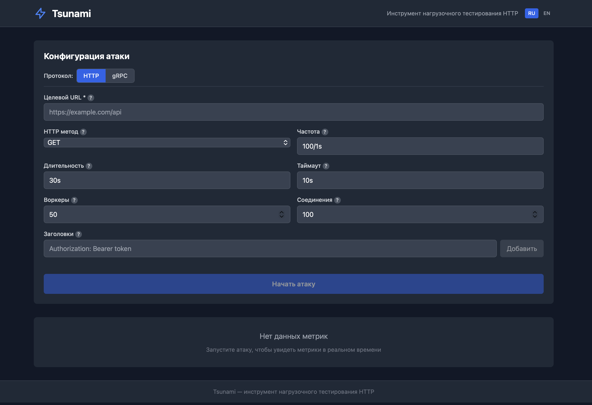

# Tsunami

Tsunami is an HTTP and gRPC load testing tool for stress testing web services with a constant request rate. It features a CLI for terminal usage and a web UI for visual monitoring.


## Install

### Pre-compiled binaries

Download from [GitHub Releases](https://github.com/paniccaaa/tsunami/releases).

### Homebrew (macOS/Linux)

```sh
brew install paniccaaa/tap/tsunami
```

### Source

```sh
git clone https://github.com/paniccaaa/tsunami.git
cd tsunami
make build
```

Requires Go 1.25+ and Node.js 20+.

### Go (CLI-only, no web UI)

```sh
go install github.com/paniccaaa/tsunami@latest
```

### Docker

```sh
docker-compose up --build
# Open http://localhost:8080
```


## Usage

```
Usage: tsunami [global flags] <command> [command flags]

Global flags:
  --cpus int    Number of CPUs to use (default: all)
  -h, --help    Show help
  -v, --version Print version

Commands:
  attack      Run an HTTP load test
  grpc        Run a gRPC load test
  serve       Start web UI server
```

### `tsunami attack`

```
Usage: tsunami attack [flags]

Flags:
  -u, --url string             Target URL (required)
  -m, --method string          HTTP method (default "GET")
  -b, --body string            Request body
  -H, --headers stringArray    Request headers, repeatable
  -r, --rate string            Request rate (default "100/1s")
  -d, --duration duration      Attack duration; 0 = infinite (default 0)
  -t, --timeout duration       Per-request timeout (default 10s)
  -w, --workers uint           Number of workers (default 50)
  -c, --connections uint       Number of connections (default 100)
  -o, --output string          Output file for JSON report (default "stdout")
```

#### `-r, --rate`

Specifies the request rate in `N/Vunit` format:
- `N` — number of requests
- `V` — time value
- `unit` — one of `ms`, `s`, `m`, `h`

```
100/1s    100 requests per second
50/500ms  100 requests per second
1000/1m   ~16.6 requests per second
```

#### `-d, --duration`

When set to `0`, the attack runs until interrupted with `Ctrl+C`.

```
30s       30 seconds
5m        5 minutes
1h        1 hour
0         infinite (until Ctrl+C)
```

#### `-o, --output`

Use `stdout` for terminal text output or a file path for JSON report.

```sh
# Text output to terminal
tsunami attack -u https://example.com

# JSON report to file
tsunami attack -u https://example.com -o results.json
```

#### Live progress output

While running, the CLI displays a live status line:

```
⠹ 12.3s [████████░░░░░░░░░░░░] 42% | Reqs: 1230 | RPS: 99.8/100 | Avg: 8ms | Err: 0 | Now: 100/s
```

#### Summary output (stdout mode)

```
=== Summary ===        Total/successful/failed requests
=== Timing ===         Elapsed time, avg/min/max latency
=== Throughput ===     Target RPS, actual RPS, gap %
=== Data Transfer ===  Bytes sent/received, bandwidth
=== Latency Percentiles === P50 / P90 / P95 / P99
=== Status Codes ===   Per-code counts and %
=== Error Breakdown === Timeout / ConnRefused / DNS / TLS / Other
```

### `tsunami grpc`

```
Usage: tsunami grpc [flags]

Flags:
  --target string              gRPC server address in host:port format (required)
  --service string             Fully qualified service name, e.g. helloworld.Greeter (required)
  --method string              RPC method name, e.g. SayHello (required)
  --data string                JSON request payload (default "{}")
  --proto string               Path to .proto file (uses server reflection if omitted)
  --grpc-metadata stringArray  Metadata as key:value pairs, repeatable
  --insecure                   Disable TLS (for local testing)
  --ca-cert string             Path to PEM-encoded CA certificate
  -r, --rate string            Request rate (default "100/1s")
  -d, --duration duration      Attack duration; 0 = infinite (default 0)
  -t, --timeout duration       Per-request timeout (default 10s)
  -w, --workers uint           Number of workers (default 50)
  -c, --connections uint       gRPC channel pool size (default 4)
  -o, --output string          Output file for JSON report (default "stdout")
```

By default, method signatures are resolved via **server reflection**. Pass `--proto` to use a local `.proto` file instead.

#### Examples

```sh
# Unary call via server reflection
tsunami grpc \
  --target localhost:50051 \
  --service helloworld.Greeter \
  --method SayHello \
  --data '{"name":"world"}' \
  --insecure \
  --duration 30s

# Using a .proto file with auth metadata
tsunami grpc \
  --target api.example.com:443 \
  --proto ./service.proto \
  --service myapp.UserService \
  --method GetUser \
  --data '{"id":"123"}' \
  --grpc-metadata "Authorization: Bearer token" \
  --rate 200/1s \
  --duration 1m \
  -o report.json
```

#### gRPC summary output

Same structure as HTTP, but status codes are shown as gRPC status names:

```
=== gRPC Status Codes ===
  [OK]: 5982 (99.70%)
  [UNAVAILABLE]: 18 (0.30%)
```

### `tsunami serve`

```
Usage: tsunami serve [flags]

Flags:
  -p, --port int    Server port (default 8080)
```

Starts an HTTP server with web UI, REST API, and WebSocket metrics stream.

```sh
tsunami serve
# Starting Tsunami HTTP server on http://localhost:8080
# WebSocket endpoint: ws://localhost:8080/ws/metrics
```



#### API endpoints

```
POST /api/attack/start            Start a load test (HTTP or gRPC)
POST /api/attack/stop             Stop the current test
GET  /api/attack/status           Current status and live metrics
GET  /api/attack/results          Final results (after test completes)
GET  /api/attack/results/download Download results as JSON file
POST /api/proto/upload            Upload a .proto file for gRPC tests
WS   /ws/metrics                  Real-time metrics stream (50ms interval)
GET  /health                      Health check
```

##### `POST /api/attack/start` — HTTP

```json
{
  "url": "https://example.com",
  "method": "GET",
  "body": "",
  "headers": ["Authorization: Bearer token"],
  "rate": "100/1s",
  "duration": "30s",
  "timeout": "10s",
  "workers": 50,
  "connections": 100
}
```

##### `POST /api/attack/start` — gRPC

```json
{
  "protocol": "grpc",
  "grpc_target": "localhost:50051",
  "grpc_service": "helloworld.Greeter",
  "grpc_method": "SayHello",
  "grpc_data": "{\"name\": \"world\"}",
  "grpc_proto": "/tmp/tsunami-proto-12345.proto",
  "grpc_metadata": ["key: value"],
  "insecure": true,
  "rate": "50/1s",
  "duration": "30s",
  "workers": 10,
  "connections": 4
}
```

Upload a `.proto` file first with `POST /api/proto/upload` (multipart form, field `file`) to get the `grpc_proto` path.


## Examples

### Basic attack

```sh
tsunami attack -u https://httpbin.org/get
```

### POST request with JSON body

```sh
tsunami attack \
  -u https://httpbin.org/post \
  -m POST \
  -H "Content-Type: application/json" \
  -b '{"name": "test"}'
```

### High-rate attack with duration

```sh
tsunami attack \
  -u https://example.com \
  -r 1000/1s \
  -d 1m \
  -w 100 \
  -c 200
```

### Save results to JSON

```sh
tsunami attack \
  -u https://example.com \
  -d 30s \
  -o report.json
```


## Build commands

```sh
make build              # Build binary with embedded frontend
make build-cli          # Build CLI-only (no web UI)
make frontend           # Build React frontend only
make test               # Run unit tests
make test-integration   # Run integration tests
make vet                # Run go vet
make run                # go run attack example (httpbin)
make run-serve          # go run serve
make docker             # docker-compose up --build
make clean              # Remove binary and frontend/dist
```


## License

MIT
