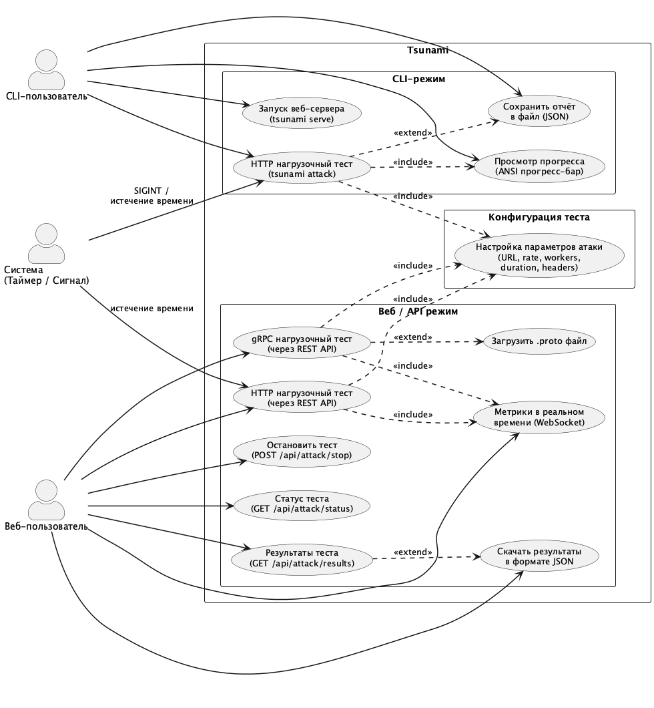
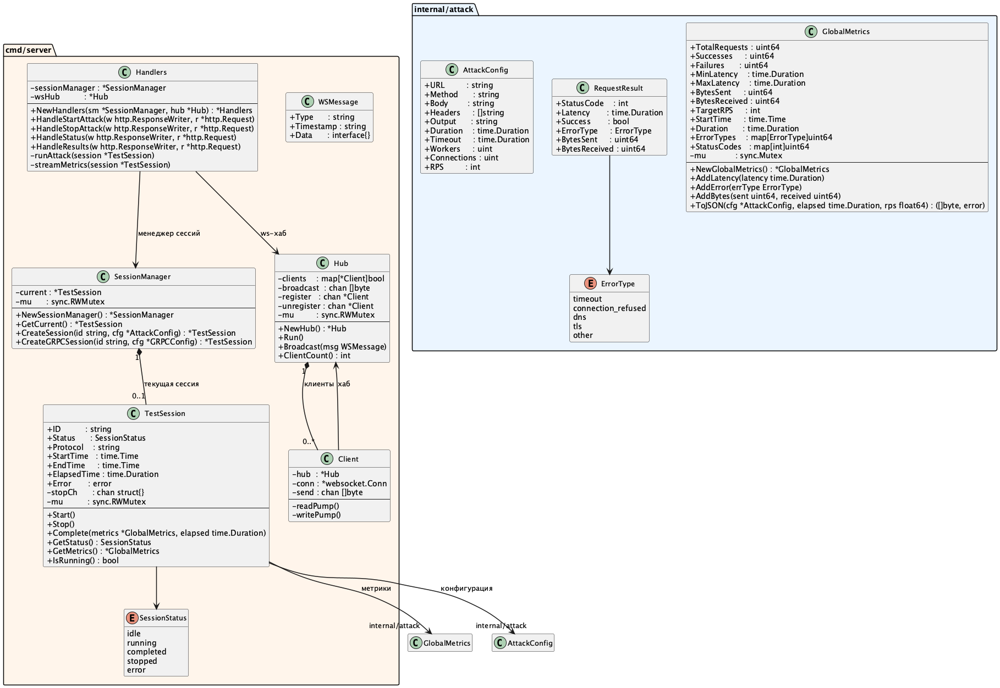
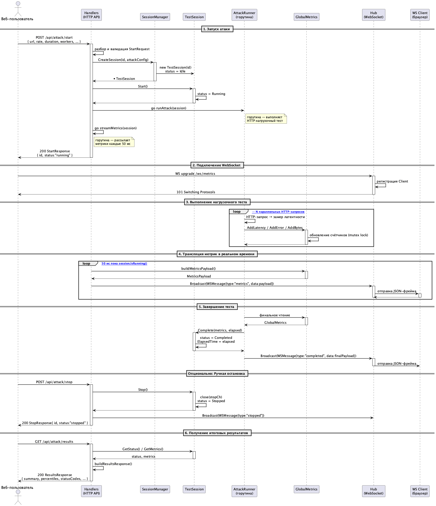
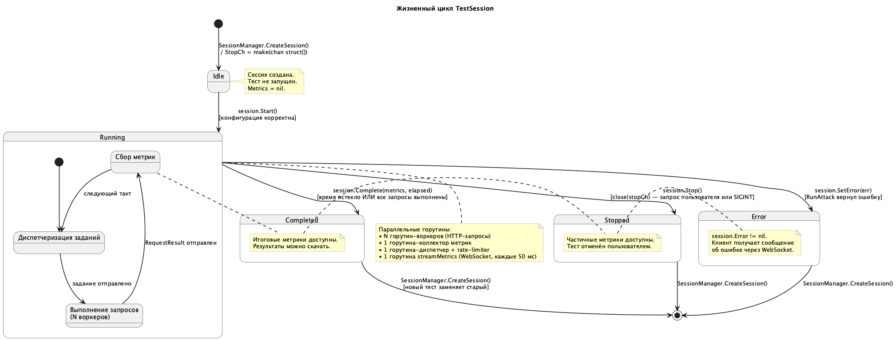
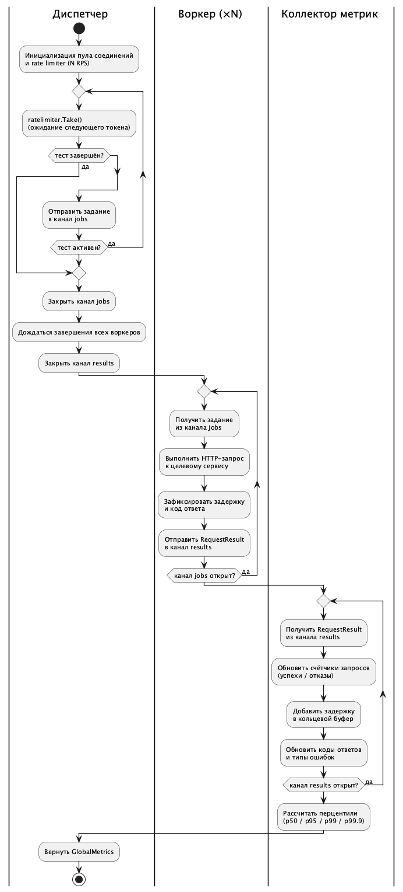

# Диаграммы UML — Tsunami

**Tsunami** — CLI-инструмент нагрузочного тестирования HTTP-сервисов, написанный на Go.  
Инструмент позволяет:
- отправлять HTTP/gRPC-запросы с заданной скоростью (RPS) к целевому сервису;
- контролировать количество параллельных соединений и воркеров;
- собирать метрики в реальном времени (задержки, статус-коды, ошибки);
- отображать результаты в терминале или экспортировать в JSON;
- управлять тестом через REST API и веб-интерфейс с WebSocket-стримингом метрик.

---

## Структура файлов

| Файл | Тип диаграммы | Что раскрывает |
|------|--------------|----------------|
| `use_case_ru.puml` | Вариантов использования | Акторы и пользовательские сценарии |
| `classes.puml` | Классов | Статическая структура пакетов и ключевых типов |
| `sequence.puml` | Последовательности | Динамика запуска теста через Web API + WebSocket |
| `state_ru.puml` | Состояний | Жизненный цикл сессии тестирования (`TestSession`) |
| `activity_ru.puml` | Деятельности | Алгоритм выполнения CLI-команды `tsunami attack` |

---

## Диаграммы

### 1. Варианты использования

Показывает акторов системы и их пользовательские сценарии.

**Акторы:**
- **CLI User** — запускает `tsunami attack` из командной строки.
- **Web User** — взаимодействует через React SPA или REST API.
- **System** — таймер длительности теста и обработчик системных сигналов (SIGINT).

**Ключевые сценарии:** запуск HTTP/gRPC-теста, настройка параметров, просмотр метрик в реальном времени, остановка теста, выгрузка JSON-отчёта, загрузка `.proto`-файла.

---

### 2. Классы

Отображает статическую структуру двух основных пакетов.

**`internal/attack`** — ядро движка нагрузки:
- `AttackConfig` — конфигурация теста (URL, метод, RPS, воркеры, таймауты).
- `GlobalMetrics` — потокобезопасный агрегатор метрик.
- `RequestResult` — результат одного HTTP-запроса.

**`cmd/server`** — HTTP/WebSocket-сервер:
- `TestSession` — сессия теста со статусом и каналом остановки.
- `SessionManager` — управляет единственной активной сессией.
- `Handlers` — HTTP-обработчики REST API.
- `Hub` / `Client` — WebSocket-хаб и клиент (gorilla/websocket).

---

### 3. Последовательность

**Сценарий:** веб-пользователь запускает HTTP-тест через REST API и получает метрики через WebSocket.

1. Разбор и валидация запроса, создание `TestSession` через `SessionManager`.
2. Параллельный запуск горутин: `runAttack` и `streamMetrics`.
3. Цикл сбора метрик в `GlobalMetrics` воркерами.
4. Трансляция метрик через `Hub` каждые 50 мс.
5. Завершение теста и финальный broadcast.
6. Получение итогового отчёта через `GET /api/attack/results`.

---

### 4. Состояния

**Объект:** `TestSession`

Показывает жизненный цикл сессии: `Idle → Running → Completed | Stopped | Error`.  
Отражает нормальное завершение по истечении `duration`, принудительную остановку по сигналу пользователя или SIGINT, а также переход в `Error` при сбое движка.

---

### 5. Деятельность

**Субъект:** команда `tsunami attack` (CLI)

Плавательные дорожки: `CLI`, `AttackRunner`, `Worker(×N)`, `MetricsCollector`

Показывает полный алгоритм: разбор флагов, создание HTTP-клиента с пулом соединений, параллельный запуск воркеров и rate-limiter, сбор метрик, корректное завершение горутин и вывод отчёта.

